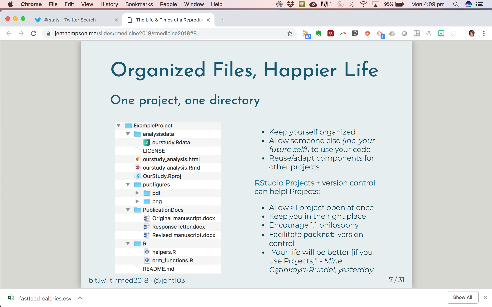
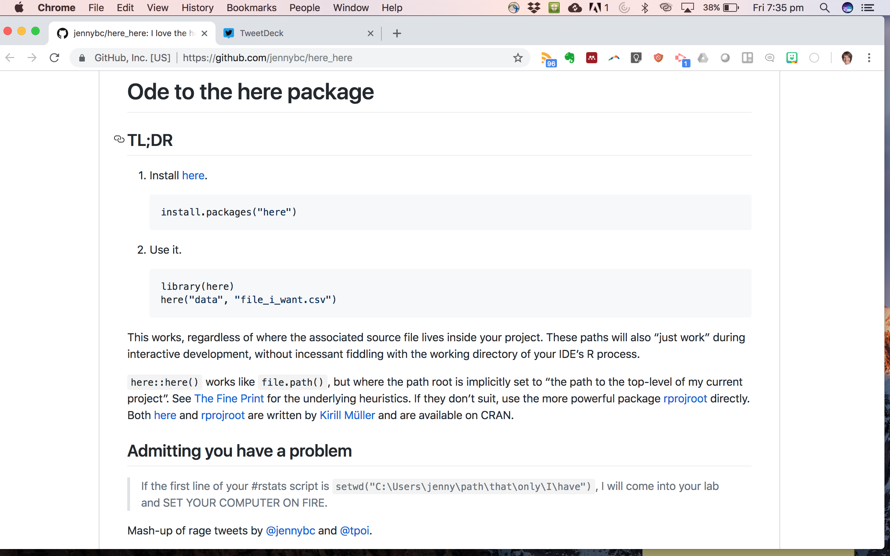

As I add new projects to my rstats portfolio and work collaboratively on projects with students the issue of working directories is becoming more and more complicated. Not really understanding how working directories and file paths actually work, I have been relying on the beginner logic...

> Everything will be just fine as long as you keep your datafiles in the same folder as your .rmd file 

<iframe src="https://giphy.com/embed/vItkAzRz4wTv2" width="480" height="317" frameBorder="0" class="giphy-embed" allowFullScreen></iframe><p><a href="https://giphy.com/gifs/vintage-everyday-hindenburg-vItkAzRz4wTv2">via GIPHY</a></p>

I aspire to have organized folders that [Jen Thompson](@jent103) would be proud of, but that is going involve getting my head around directories.


```r

```


Sidenote- check out [slides from Jen Thompson's awesome RMed2018 talk](bit.ly/jlt-rmed2018) about reproducible clinical projects

### enter the `here()` package. 

I learned about this package from one of Jenny Bryan's many talks/ twitter posts. I so strongly associate it with Jenny (she even has an [Ode to Here post](https://github.com/jennybc/here_here) on her blog) that I mistakenly thought that she wrote it, but no. 


```r

```


It was actually developed by [Kirill Muller](@krlmlr), a data scientist from Switzerland. 

Here is how it works. 

##### 1. Install it

```
install.packages("here")
```


##### 2. Load it
```
library(here)
```

##### 3. Use it

So far I have just used `here()` to find a folder of .csv files and load them into R. 

When you load the `here()` package, R assumes that "here" is the folder that your project file lives in

Call here() to check where R thinks here is. It will return the highest folder level of the folder where the proj file lives. 

```
here()
```

You can use `here()` to refer to places where files might live, relative to "here". In this example, within the project folder, there are subfolders called Data, within that we are interested in a folder called Dynamic, and within that the folder called Raw. 

Make a file path by specifying...

```
filefolder <- here("Data", "Dynamic", "Raw")
```

Then you can use that file path in the command below to tell R where to look for the files. 

Looks for all the .csv files and makes a list of them called "files"
```
files <- dir(filefolder, pattern = "*.csv")
files
```

Then use map() to take that list, run read_csv on all of them and bind them together.
```
EMGdata <- files %>%
  map(read_csv) %>% 
  reduce(rbind)

```

##### Other uses for `here()` that I haven't tried this yet

I've also seen `here()` used to save out of ggplot. I am assuming this says save the cleveland figure in the folder called figs, which you can find "here". 

```
ggsave(here("figs", "cleveland-alloc.png"))

```

How have you used `here()` ?
