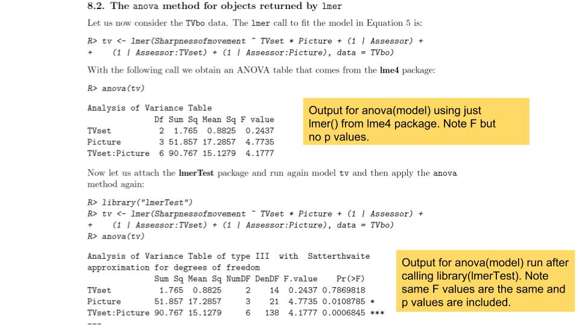

When we want to learn how to do something new in R, we all start by googling it. Having worked out simple ANOVA, next on my list is repeated measures.  

[Domnique Makowski](https://dominiquemakowski.github.io/) has an excellent blog post that comes up at the top of the search results when you google "how to do repeated measures ANOVA in R".

He lures you in with a [post that seems like it is going to solve all your problems](https://neuropsychology.github.io/psycho.R/2018/05/01/repeated_measure_anovas.html) and then and BAM... starts the post by saying "DON'T do it". 

HAHAHAHAHA- got me....

## `psycho` package 

NOTE May2021: The psycho package has been updated and the code below may not work anymore https://github.com/easystats/easystats/issues/58

Yes I know that I should be doing linear mixed models instead, so lets see whether his `psycho` package really makes it as easy as promised. 


```r
library(lme4)
library(lmerTest)
library(tidyverse)
library(psycho)
```

### ANOVA Recap

#### One-way ANOVA
When we were talking one-way ANOVA we used this formula. 

```
aov(outcome ~ group, data = dataset)
```

#### Old school: Repeated-measures ANOVA
When participants contribute to all levels of condition, we need to describe that in the error term. Here the format of the aov call hasn't changed much.

```
aov(outcome ~ condition + Error(Participant/condition), 
    data= dataset)
```
#### New school: Linear mixed models

The only difference between RM anova and linear mixed models is that you call `lmer` from the `lme4` package, instead of `aov` and specify a random effect of Participant (1|Participant) instead of the error term. 

```
lmer(outcome ~ condition + (1|Participant), 
    data= dataset)

```
#### Example: Rapid facial mimicry

When we see someone smile, the muscles in our cheek that would produce a smile contract a tiny little bit. When we see someone display an angry expression, the muscles in our brow activate too. 

This mimicry response is really robust in adults, but working out under what conditions it occurs in kids has kept me busy for a few years. This year my honours student Bronte is looking at how social context (i.e. competition vs cooperation) influences how kids mimic facial expressions of emotion. 

In this experiment, we have participants watching pictures of different expressions (happy, angry) and we are recording activity from different muscle sites (brow, cheek). We are also showing kids pictures of confederates that they cooperated with, competed against, along with novel faces. In each condition (cooperator, competitor, novel), we want to determine whether the muscle activity differs as a function of emotional expression. 

The advantage of LMM, in addition to allowing us to control for random effects of Participant, is that it doesn't require that we have perfectly complete data, which is handy because... kids.

Lets plot responses to the competitor displaying happy vs. angry expressions. 


```r
EMGdata <- read_csv("BronteEMG.csv")

EMGdata_competitor <- EMGdata %>%
  filter(role == "Competitor", emotion != "NEUTRAL") 
```


```r
EMGdata_competitor %>%
  group_by(emotion, muscle) %>%
  summarise(meanresponse = mean(response, na.rm = TRUE)) %>%
  ggplot(aes(x = emotion, y= meanresponse, fill = emotion)) +
  geom_bar(stat = "identity", position = "dodge", width = 0.8) +
  facet_wrap(~muscle) +
  scale_y_continuous(expand = c(0, 0),                    
                     limits = c(-0.05, 0.25))
```

```
## `summarise()` has grouped output by 'emotion'. You can override using the `.groups` argument.
```

}}index_files/figure-html/unnamed-chunk-3-1.png" width="672" />
Looks like a emotion x muscle interaction :)
 
#### New way: Linear Mixed Models

The code to run LMM is almost the same as aov; here we are still testing how well we can predict the response (outcome) from emotion and muscle , but now these are called  "fixed effects".  And instead of specifying the Error term to account for the within subjects nature of the data, we can add Participant to the model as a "random effect". 

Instead of calling aov(), we now use lmer() from the lme4 package. Again we assign the model to an object, but this time run an anova() on the object. 

#### Fit the model


```r
lmm_EMG <- lmer(response ~ emotion + muscle + emotion*muscle + (1|Participant), data=EMGdata_competitor)

anova(lmm_EMG)
```

```
## Type III Analysis of Variance Table with Satterthwaite's method
##                 Sum Sq Mean Sq NumDF  DenDF F value  Pr(>F)  
## emotion        0.23791 0.23791     1 79.159  3.3608 0.07053 .
## muscle         0.10038 0.10038     1 75.082  1.4180 0.23748  
## emotion:muscle 0.27447 0.27447     1 75.082  3.8772 0.05264 .
## ---
## Signif. codes:  0 '***' 0.001 '**' 0.01 '*' 0.05 '.' 0.1 ' ' 1
```

### EMG + psycho

NOTE: psycho doesn't seem to have an analyze function anymore...

#### The `analyze` function

The `psycho` package allows you to test the fit of the model and generates a description of the results using an `analyze` and then `summary` and `print` functions. 


```r
library(psycho)

results <- psycho::analyze(lmm_EMG)
```


```r
summary(results)
```

This LMM practically writes itself! Use print(results) to generate an almost manuscript ready description of the model. 


```r
print(results)
```

Here we are most interested in the interaction, so we can use `get_contrasts` for the interaction term, add them to the results and print them too.  

#### `get_contrasts`


```r
results <- get_contrasts(lmm_EMG, "emotion*muscle")

print(results$contrasts)

#note default is Tukey correction
```


```r
print(results$means) #get estimated marginal means
```

### psycho steps

1. define the model and and run it

       model <- lmer(outcome ~ fixed_effects + (1|random_effect), data=dataset)
       
2a. then anova(model)
       
2b. OR summary(model)
       
3. to get user friendly descriptions you can plug into other things use results <- analyze(model) 
       
4. to get all info you might want to report (both ANOVA and regression format) ask for  summary(results)
       
5. to get manuscript ready descriptions use ask for print(results) 
       
6. to work out interactions  get_contrasts(model)
       
### THOUGHTS about psycho

- there are a lot of steps
- do I really need all of this output? 
- how do I write about this?

## Likelihood Ratio Tests

The psycho package relies on the `lmerTest` package to generate p values, which in "Linear Mixed Model Land" are controversial. The alternative approach is to apply Likelihood Ratio Tests. This procedure involves running a model with ALL of your interesting fixed effects in it, then running a model that removes the fixed effects you are most interested in. By comparing the "fit" of model 1 vs. model 2 you can get an idea of whether the variable of interest is important. 

Bodo Winter has a [great two part](tutorialhttp://www.bodowinter.com/tutorials.html) that lays out the logic of this nicely. He uses a hiking analogy that I found really useful in getting my head around the idea of Likelihood Ratio Tests.

### Lets go hiking

Imagine we were interested in predicting hiking speed and we wanted to know whether carrying water and/or carrying a flashlight impacts the speed that we walk. 

To test the effect of water, we could run model 1, which includes fixed effects of both water and flashlight, and model 2, which removes the effect of water. Then we could compare model 1 and model 2. If model 1 fits the data better (as evidenced by a *lower* AIC value), we can say that carrying water slows us down. 

model1 = hiking speed ~ gallon of water + flashlight

model2 = hiking speed ~ flashlight

### EMG + LRT 
Using this approach with our EMG data would involve fitting a model with both main effects (emotion and muscle) AND the interaction between emotion * muscle included. 

Because we are most interested in whether there is a differential muscle activity in response to each emotion (i.e. is cheek activity greater for happy than angry faces and brow activity greater for angry then happy), our comparison model would remove the interation term. 

Note when you are running LMM and planning to compare models, you should add REML= FALSE to the end of the code. Changes the internal workings in mysterious ways. 


```r
model_target <- lmer(response ~ emotion + muscle + emotion*muscle + (1|Participant), data=EMGdata_competitor, REML= FALSE)
```


```r
model_null <- lmer(response ~ emotion + muscle + (1|Participant), data=EMGdata_competitor, REML= FALSE)
```


```r
anova(model_null, model_target)
```
Interpretation= when the AIC (Akaike information criterion) is lower, the model fits the data better. Here we can say that the emotion * muscle interaction is important, because there the model_target is a better fit of the data than model_null is. 

### THOUGHTS about LRT 

- this is way simpler and more intuitive than psycho
- but I feel like I need something else
- it doesn't seem enough to only know that the interaction is important
- how do I write about this?

## `lmerTest` package 

As mentioned above, significance testing in LMM is controversial. The authors of the `lme4` package didn't include p values in the model output, because they argue that there is no way to estimate degrees of freedom. I don't pretend to have a full grasp on the statistical intricacies, but the [paper that goes with the `lmerTest` package](https://www.jstatsoft.org/article/view/v082i13) is worth a read. 

### is LRT anticonservative?

In this paper, the authors argue that of course researchers using LMM want some indication of the significance of their effect but that a LRT approach is anti-conservative. They  designed the `lmerTest` package to provide an alternative. 

The `lmerTest` approach uses Satterthwaite's method (as does SAS software) to estimate degrees of freedom and make it possible for both anova() and summary() functions on lmer objects to include p values. 

This example illustrates the difference in output when you run anova() on model before and after loading library(lmerTest)


```r

```


### EMG + lmerTest

Using the lmerTest approach, we would load library(lmerTest) first, then run the model including all interesting fixed and random effects. Then call anova() and/or summary() to get Fs and ps and/or Estimates. 


```r
library(lmerTest)

model_lmerTest <- lmer(response ~ emotion + muscle + emotion*muscle + (1|Participant), data=EMGdata_competitor)
```

Then get anova() and/or summary() to get Fs and Ps, and beta estimates. 


```r
anova(model_lmerTest)
```

```
## Type III Analysis of Variance Table with Satterthwaite's method
##                 Sum Sq Mean Sq NumDF  DenDF F value  Pr(>F)  
## emotion        0.23791 0.23791     1 79.159  3.3608 0.07053 .
## muscle         0.10038 0.10038     1 75.082  1.4180 0.23748  
## emotion:muscle 0.27447 0.27447     1 75.082  3.8772 0.05264 .
## ---
## Signif. codes:  0 '***' 0.001 '**' 0.01 '*' 0.05 '.' 0.1 ' ' 1
```


```r
summary(model_lmerTest)
```

```
## Linear mixed model fit by REML. t-tests use Satterthwaite's method [
## lmerModLmerTest]
## Formula: response ~ emotion + muscle + emotion * muscle + (1 | Participant)
##    Data: EMGdata_competitor
## 
## REML criterion at convergence: 48.2
## 
## Scaled residuals: 
##      Min       1Q   Median       3Q      Max 
## -2.86009 -0.40051 -0.01831  0.37171  2.89182 
## 
## Random effects:
##  Groups      Name        Variance Std.Dev.
##  Participant (Intercept) 0.01489  0.1220  
##  Residual                0.07079  0.2661  
## Number of obs: 106, groups:  Participant, 28
## 
## Fixed effects:
##                          Estimate Std. Error       df t value Pr(>|t|)    
## (Intercept)               0.19192    0.05628 94.48281   3.410 0.000957 ***
## emotionHAPPY             -0.19736    0.07342 77.13899  -2.688 0.008798 ** 
## muscleCHEEK              -0.16335    0.07241 75.08189  -2.256 0.026998 *  
## emotionHAPPY:muscleCHEEK  0.20358    0.10339 75.08189   1.969 0.052636 .  
## ---
## Signif. codes:  0 '***' 0.001 '**' 0.01 '*' 0.05 '.' 0.1 ' ' 1
## 
## Correlation of Fixed Effects:
##             (Intr) emHAPPY mCHEEK
## emotinHAPPY -0.638               
## muscleCHEEK -0.643  0.493        
## eHAPPY:CHEE  0.451 -0.704  -0.700
```

### THOUGHTS about lmerTest

- this approach seems the most like repeated measures ANOVA
- I still don't really know how to write about this

## Next: "how to write about LMM"
