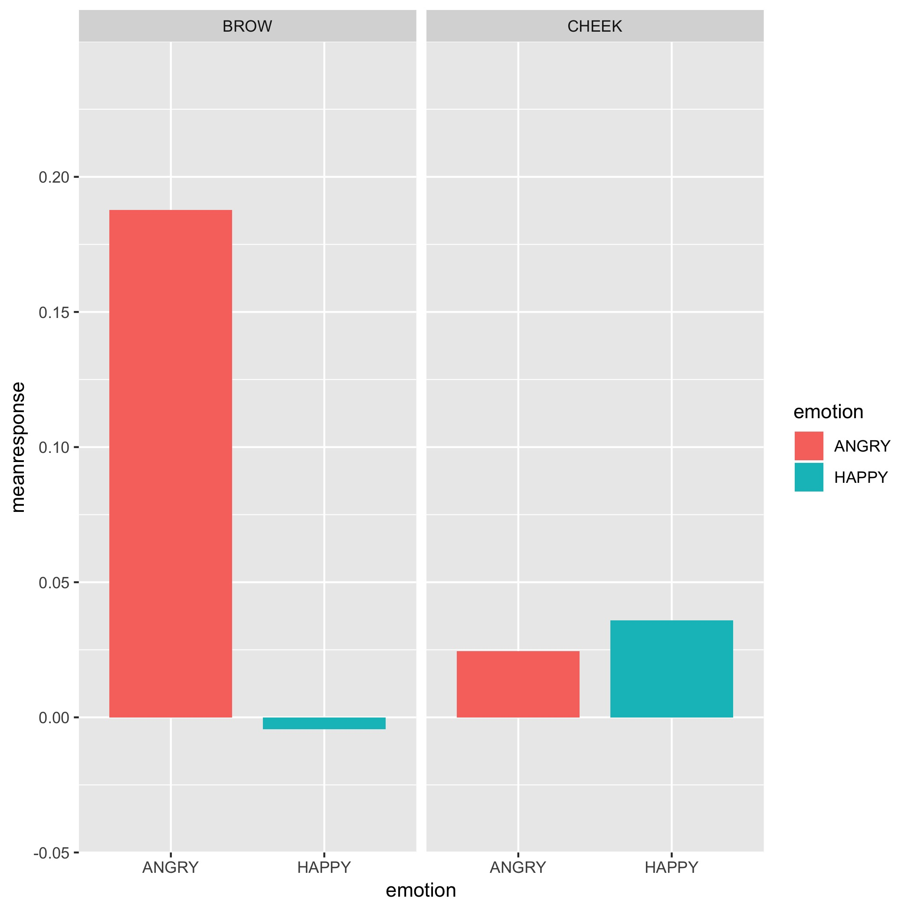

Learning new things is HARD. Stats methods are particularly hard because it not just about running the test. You have to...

- learn when to run the test
- learn how to run the test
- learn how to interpret the test AND
- learn how to write about the results of the test 


Part of what makes this learning hard is that our research methods training has drummed into us that there is a RIGHT WAY TO DO IT.

In the real world, there are LOTS OF WAYS TO DO IT.  Some ways might be more appropriate than other ways, given the data you are dealing with or the question you are most interested in. But people who teach statistics have VERY STRONG OPINIONS, like... 

<blockquote class="twitter-tweet" data-lang="en"><p lang="en" dir="ltr">Reading this Magezi paper <a href="https://t.co/FJl2KbHOyn">https://t.co/FJl2KbHOyn</a> - apparently &quot;encouraging experimental psychologists to use LMM is like giving shotguns to toddlers&quot; awesome- this is not the first time this week I have felt like an <a href="https://twitter.com/hashtag/rstats?src=hash&amp;ref_src=twsrc%5Etfw">#rstats</a> baby <a href="https://t.co/NvWLMlzBvT">pic.twitter.com/NvWLMlzBvT</a></p>&mdash; Dr Jenny Richmond (@JenRichmondPhD) <a href="https://twitter.com/JenRichmondPhD/status/1042908079732404224?ref_src=twsrc%5Etfw">September 20, 2018</a></blockquote>
<script async src="https://platform.twitter.com/widgets.js" charset="utf-8"></script>


As a learner who is trying to teach themselves a new method, it is tough to give up on the idea that the goal is to work out the RIGHT WAY. It is also difficult to work out which ways might be better than others, because research methods training seldom teaches you how to evaluate the suitability of a particular approach, given the particular data situation you are in. Most often when you are learning statistics you are working with "perfect" data; data in the real world is never perfect, particularly when you work with infants and kids. 

I think we need to change the way we teach research methods to psychology students, but that is another post for another day. 

Today I have worked out how to run the test... now I need to interpret the results and write about them. 

What to do? Ask for help...

<blockquote class="twitter-tweet" data-lang="en"><p lang="en" dir="ltr">I have worked out how to run a linear mixed model in <a href="https://twitter.com/hashtag/rstats?src=hash&amp;ref_src=twsrc%5Etfw">#rstats</a> (see rest of thread for resources I found helpful), but now I&#39;m pretty stuck with how to write about it. Looking for tips...papers that report LMM, preferably in exp psyc, ideally development <a href="https://twitter.com/Infantstudies?ref_src=twsrc%5Etfw">@Infantstudies</a> <a href="https://twitter.com/SRCDtweets?ref_src=twsrc%5Etfw">@SRCDtweets</a> <a href="https://t.co/Ze6l7qT8Kc">pic.twitter.com/Ze6l7qT8Kc</a></p>&mdash; Dr Jenny Richmond (@JenRichmondPhD) <a href="https://twitter.com/JenRichmondPhD/status/1042893852233818113?ref_src=twsrc%5Etfw">September 20, 2018</a></blockquote>
<script async src="https://platform.twitter.com/widgets.js" charset="utf-8"></script>

[Jessica Koski's](@JessKoski) suggestion to look at papers that use LMM in a similar context (particularly [Mike Frank's](@mcxfrank) papers in my case) was a good one. This is true of writing in general, not just writing about stats. There is value in emulating those who you think do it well.

Mike also weighed into the conversation (how great is twitter?) and shared his reporting rules: 

- describe the full specification of the model including random effects (maybe with the model formula)
- try to give fixed effects coefficients in a table, at least for your main model
    - well that sounds easy...

<blockquote class="twitter-tweet" data-lang="en"><p lang="en" dir="ltr">That’s really nice Jessica! My rules: make sure to describe the full specification including random effects (maybe with model formula), try to give fixed effects coefficients in a table so readers can interpret, at least for your main model.</p>&mdash; Michael C. Frank (@mcxfrank) <a href="https://twitter.com/mcxfrank/status/1042974130281185281?ref_src=twsrc%5Etfw">September 21, 2018</a></blockquote>
<script async src="https://platform.twitter.com/widgets.js" charset="utf-8"></script>


Looking at developmental science papers that have reported LMM,  I found two papers that I PARTICULARLY liked. 

1. [Kaburu, S. S., Paukner, A., Simpson, E. A., Suomi, S. J., & Ferrari, P. F. (2016). Neonatal imitation predicts infant rhesus macaque (Macaca mulatta) social and anxiety-related behaviours at one year. Scientific Reports, 6, 34997.](https://www.ncbi.nlm.nih.gov/pmc/articles/PMC5057109/)

This baby monkey imitation paper might be my favorite example. It could be because the format of Scientific Reports is nice, but I think the reporting about what they did and what they found is clear. 
I like this table and can see how it is helpful to the reader to see the coefficients for each model. 


```r
knitr::include_graphics("monkey table.png")
```


2. [Nordmeyer, A. E., & Frank, M. C. (2018). Early Understanding of Pragmatic Principles in Children’s Judgments of Negative Sentences. Language Learning and Development, 1-17.](https://www.tandfonline.com/doi/full/10.1080/15475441.2018.1463850)

This recent paper out of Mike's lab is SUPER useful because the [R markdown file](http://anordmey.github.io/neg-tablet/negpad-analysis.html) is on github, so you can compare the rstats code/output to what is reported in the paper. 

> Go open science! 


### What I learned from reading a lot of writing about LMM

##### 1. First, you need to explain why you are using LMM...

...rather than some more well known analysis like repeated-measures ANOVA. 

**THEORETICAL REASON**
- experimental psychologists average across potentially important things (participants, stimuli, items, scenarios, confederates) ALL THE TIME. In doing so, we are assuming that they don't make a difference to our participants' behaviour. For example, the identities of the confederates that happened to be the competitor vs. collaborator for any individual child shouldn't matter, because all the confederates were following the experiment script and behaving in the same way. In theory it shouldn't matter, but human behavior is complex and it probably does matter, maybe just a little bit. It would be nice to be able to parse that portion of the variance. LMM is nice in that it allows you to control for the potential influence of all of these things by including additional random effects. The simplest thing to do is to add random effects of participant i.e. (1|Participant) but you could also include random effects of (1|Identity) or (1|Stimulus) or (1|Scenario). 

**PRACTICAL REASON**
- you might have run a within-subjects study but can't do repeated measures ANOVA, because if you had to exclude all the kids who were missing data for one or more conditions, you would be left with N= 8 (well not quite that bad, but psychophysiology + kids ...you know what I mean). 
 

##### 2. You also need to describe how you did the analysis... 

...because as we know there are [MANY ways](
http://jenrichmond.rbind.io/post/let-me-count-the-ways/). 

> We ran linear mixed model analysis in R (version ...) using the lme4 package (Bates, Maechker, Bolker, & Walker, 2015). We included EMG response as the dependent variable and added fixed effects of emotion, muscle, as well as the interaction between emotion and muscle. We included Participant as a random effect. Significance was calculated using the lmerTest package (Kuznetsova, Brockhoff, & Christensen, 2017), which applies Satterthwaite's method to estimate degrees of freedom and generate p-values for mixed models.

##### 3. Then you need to describe the model you ran. 

I have seen this done in text, or in a footnote, but the idea is to spell out the formula. 

> The model specification was as follows: EMGresponse ~ emotion + muscle + emotion*muscle + (1|Participant)

##### 4. Then you need to describe the findings. 

My conclusion is that most people just report coefficients (and they talk about them much like you would main effects and interactions in a repeated-measures ANOVA). There is the occasional nod to Likelihood Ratio Tests, i.e. they might say that the model with the interaction term included did not improve the fit, so they stuck with only main effects, but I didn't see a lot of people comparing a model that includes all the interesting things and one that doesn't.  

Here is the plot and analysis output:


```r

```


```r
knitr::include_graphics("output.png")
```


___

There were significant main effects of emotion (beta = -0.20, t = -2.69, p = .009) and muscle (beta = -0.16, t = -2.26, p = .03), along with an emotion by muscle interaction that approached significance (beta = -0.20, t = 1.97, p = .05), reflecting the fact that while there was differential Brow activity in response to angry and happy faces displayed by a competitor, Cheek activity did not differ as a function of emotion.


##### Things I'm still not sure about. 

1. generally when I get a significant emotion by muscle interaction, I want to do post-hoc tests or look at contrasts to drill down into whether the response to angry is *significantly* greater than happy and that there is no significant difference in cheek activity to happy and angry. The `psycho` package process included running contrasts, but in all of my reading I didn't see anyone report contrasts. Is that not a thing in LMM? 

2. when initially looking at LMM output, I was thrown by the way that the main effects are expressed as emotionHAPPY and muscleCHEEK and the interaction is emotionHAPPY:muscleCHEEK. 

I think that has something to do with the reference level. If you don't tell it to do it another way, R will assign your reference levels alphabetically. So here the effects are specified relative to ANGRY and BROW. 

In the [Nordmeyer paper](https://www.tandfonline.com/doi/full/10.1080/15475441.2018.1463850), they talk about categorical variables being "deviation coded". My understanding is that rather than using ANGRY and BROW as your levels, you replace them with -0.5 and 0.5 to make the reference level more meaningful, and as a result your model more interpretable. 

3. Including a table of coefficients is one of Mike's rules and I really liked the table that was in the monkey imitation paper. But how do I make R give me nice tables? Ideally in APA format. 

##### All together now

Linear mixed models (LMM) are a becoming a popular alternative to repeated-measures ANOVA analyses in experimental psychology (Magezi, 2015). In looking at the effects of emotion and muscle on EMG activity in our experiment, there are two key advantages of a LMM approach over repeated-measures ANOVA. First, when using LMM it is possible to specify random effects (i.e. Participants). Rather than bundling this variance into an error term, linear mixed models allow us to partition the variance that is associated with these differences explicitly. Second, linear mixed models cope with missing data more easily than repeated-measures ANOVA. In the case of this dataset, there were a number of children for whom EMG data from one or more conditions was excluded due to excessive electrical noise, movement artifact or inattention. For this reason, a linear mixed models approach was most appropriate. 

We ran linear mixed model analysis in R (version ...) using the lme4 package (Bates, Maechker, Bolker, & Walker, 2015). We included EMG response as the dependent variable and added fixed effects of emotion, muscle, as well as the interaction between emotion and muscle. We included Participant as a random effect. Significance was calculated using the lmerTest package (Kuznetsova, Brockhoff, & Christensen, 2017), which applies Satterthwaite's method to estimate degrees of freedom and generate p-values for mixed models. The model specification was as follows: EMGresponse ~ emotion + muscle + emotion*muscle + (1|Participant). 

There were significant main effects of emotion (beta = -0.20, t = -2.69, p = .009) and muscle (beta = -0.16, t = -2.26, p = .03), along with an emotion by muscle interaction that approached significance (beta = -0.20, t = 1.97, p = .05), reflecting the fact that while there was differential Brow activity in response to angry and happy faces displayed by a competitor, Cheek activity did not differ as a function of emotion.
