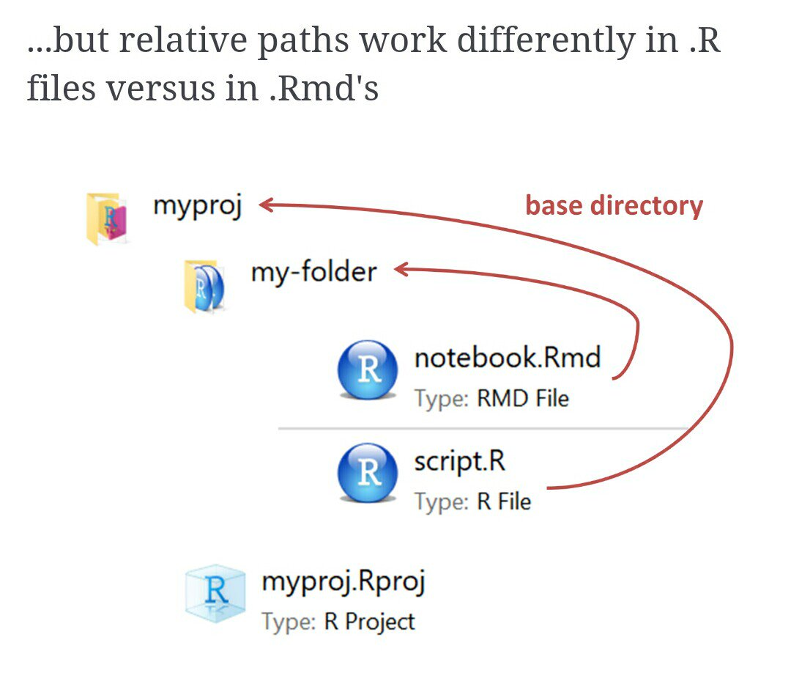
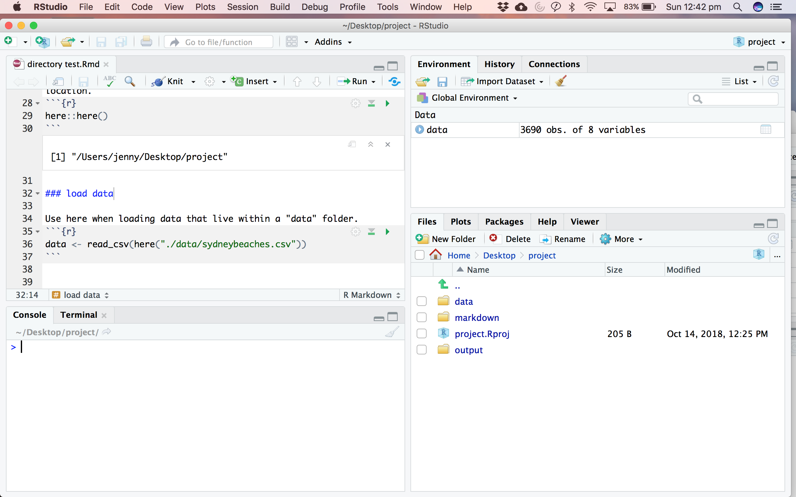

I'm still working on getting my head around where R thinks we work and how to tell it where my stuff lives (aka working directories). 

On twitter yesterday [Alison Hill](@apreshill), [Adam Gruer](@AdamGruer), [Zoe Meers](@zoe_meers) and [Irene Steves](@i_steves) helped me sort out my issues with `here`. 

<blockquote class="twitter-tweet" data-lang="en"><p lang="en" dir="ltr">hi <a href="https://twitter.com/hashtag/rstats?src=hash&amp;ref_src=twsrc%5Etfw">#rstats</a> friends, how do YOU use the `here` package? I thought I had my head around it but I&#39;m doing something wrong. Here my markdown lives within the &quot;markdown&quot; folder, so I set here to the &quot;data&quot; folder, call read_csv(here(&quot;datafile.csv&quot;) and it doesn&#39;t work... help <a href="https://t.co/ZGgxhmxegb">pic.twitter.com/ZGgxhmxegb</a></p>&mdash; Dr Jenny Richmond (@JenRichmondPhD) <a href="https://twitter.com/JenRichmondPhD/status/1053032110749937664?ref_src=twsrc%5Etfw">October 18, 2018</a></blockquote>
<script async src="https://platform.twitter.com/widgets.js" charset="utf-8"></script>


But it was THIS slide from Irene that REALLY fixed my problem. 


```r

```


I do love me a .Rmd  file but did you know that most of what makes file paths stems from in R difficult is that when you are working in a .Rmd, R makes your working directory the folder that markdown lives in, but if you are working in a script (.R) the default working directory is the top level of the project file? 

MIND BLOWN. 

So, if you are working in a markdown file, the `here` package is helpful in overcoming that not so useful default behaviour and makes it easy to define file paths relative to the top level of your project file. 

Let me summarise my understanding so that we are all clear. 

#### First always use projects

The best way to make sure you and R are working in the same place is to use Projects and to always open your analysis via a .Rproj file. That way you will always be working in the same directory as your .Rproj file. 

You can check where you are by calling `getwd`. RStudio also tells you the working directory right below the Console tab. If you are disagree with R about where you are working you can choose Session--Set Working Directory from the pull down menu to change it. 

Up until recently, I have been guaranteeing that R can always find my files just keeping everything (data, scripts, markdown, output) in that working directory folder. If you data is sitting with your analysis script, then you can just call...

```
datafile <- read_csv("data.csv")
```

... and R will find your data. It works, but it is not best practice.

#### Then use an organised file structure + `here` package 

Ideally you want to be a bit more organised than that and it is better practice to have your data live in a folder the is separate from your analysis scripts, which are in a folder separate from your output files. 

I am starting a new project and trying to set up my folder organisation as I mean to continue. I have a folder that contains an .Rproj file, and subfiles for data, markdowns, and output. 


```r

```


##### how to work out where you are

My analysis scripts (.Rmd files) live in a folder called markdown. So when you ask R what the working directory is, it defaults to that folder. This makes it difficult to tell R where your data files live. 

```
getwd()

```
[1] "/Users/jenny/Desktop/project/markdown"

##### use `here` to tell R where your data is

The `here` package allows you to set the top level of your project  folder as "here" and to specify where things live relative to that location. I was under the  misconception that `here` set the directory, but it simply builds a path to the top level of your project file everytime you use it. 

```
here::here()

```
[1] "/Users/jenny/Desktop/project"

You can use here when reading data that live within a "data" folder. 

```
data <- read_csv(here("datafolder", "datafile.csv"))
```

If your data lives in the depths of several folders, you just string the folder references together. 

```
data <- read_csv(here("datafolder", "subfolder", "datafile.csv"))
```

I like this "folder", "subfolder", "datafile.csv" method to call the path, because I am still fuzzy on how many . and / are needed in filepaths, but alternatively you can combine a more traditional file path with here. 

```
data <- read_csv(here("./datafolder/datafile.csv"))

```

You can also use `here` to make a filepath, and then use that file path to load lots of .csvs at once using map(read_csv). Check out my post about [that use case here](http://jenrichmond.rbind.io/post/where-is-here/)


Note: most of yesterday's problem stemmed from a clash between `lubridate` and `here`. If you have used lubridate it is best to be specific that you want here::here() [with 2 colons].
