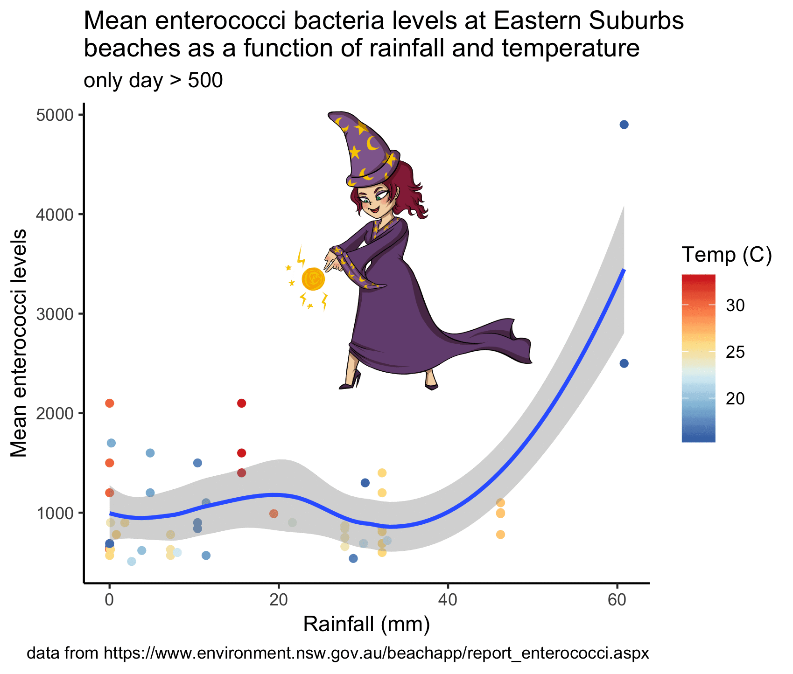
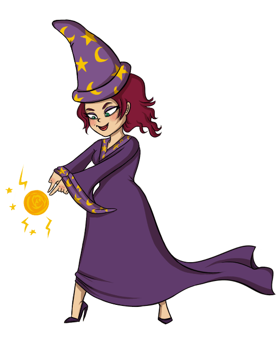

Sometimes your plot needs a celebratory gif. 

I have just finished the vizwhiz module for #RYouWithMe and to top off the series I worked out how to add an RLady Wizard to our final plot. 

Just so I'll remember for next time, here is a step by step how to...


```r

```

<!-- -->


### how to add a gif to your ggplot

1. Install the `magick` package and load it with ggplot. Install and load the `beepr` package too so you can have RStudio beep at you when it has finished rendering your gif (it can take a long time). 

```
library(ggplot)
library(magick)
library(beepr)
```

2. Plot your graph and use ggsave to save it as a .png file

```
raintemp %>%
    na.omit() %>%
    filter(beachbugs > 500) %>%
    ggplot(aes(x = rain_mm, y = beachbugs, color = temp_airport)) +
    geom_point() +
    geom_smooth() +
    theme_classic() +
    scale_colour_distiller(name = "Temp (C)", palette = "RdYlBu") +
    labs(title = "Mean enterococci bacteria levels at Eastern Suburbs \nbeaches as a function of rainfall and temperature", 
         subtitle = "only day > 500", 
         caption = "data from https://www.environment.nsw.gov.au/beachapp/report_enterococci.aspx", 
         x = "Rainfall (mm)", 
         y = "Mean enterococci levels")
    
 ggsave("beaches.png")
```


```r
knitr::include_graphics("beaches.png")
```


3. Find a gif you like and save it as a .gif file. Read the image files into Rstudio.  


```r

```

<!-- -->


```
beachplot <- image_read("beaches.png")
wizgif <- image_read("ladywiz.gif")

```


4. Make a composite image that puts the beach plot and wiz gif together. Use the offset to move the gif. 

```
frames <- image_composite(beachplot, wizgif, offset = "+600+200")

```

5. Animate the frames and write to a new gif. It will take ages, so you might like to install the `beepr` package and add a beep to alert you when it is done. The default sounds is a "ping" but if you like mario, try beep(sound = 8)

```
animation <- image_animate(frames, fps = 10)
image_write(animation, "beachwiz.gif")

beep()
```


