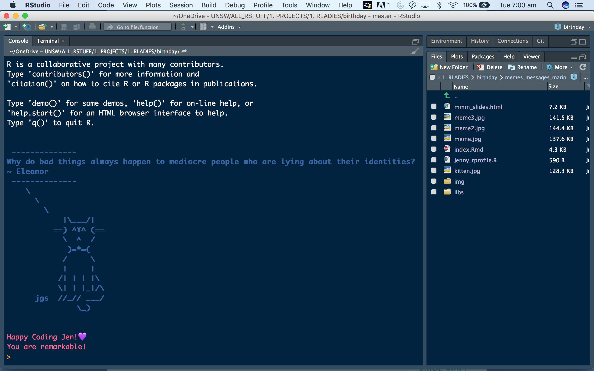
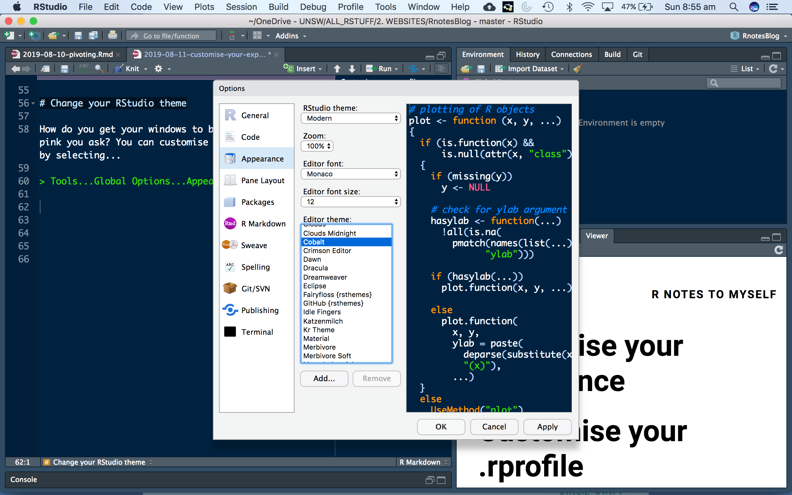
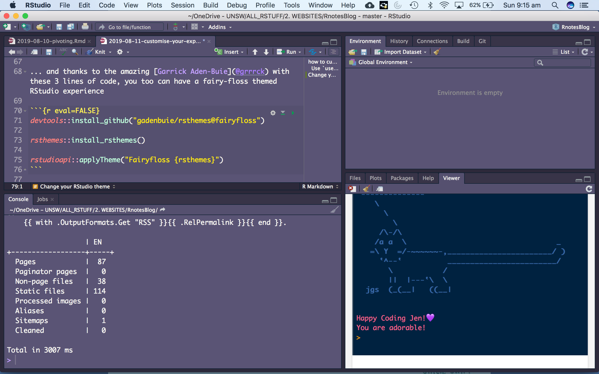

Would you like RStudio to show you a random The Good Place quote, spoken by a ASCII animal along with some random message of praise/encouragement each time you start a coding session or restart R? 

Of course you would!!! 

# how to customise your .rprofile

You will need to install the following packages:

- `usethis`
- `goodshirt`
- `cowsay`
- `praise`

### Use `usethis` to open your .rprofile file


```r
usethis::edit_r_profile()
```

Copy and paste this text into your .rprofile, save and close the file, then restart R. 


```r
#start with a quote from The Good Place (requires goodshirt package) 
#spoken by a random ASCII animal (requires cowsay package)

if (interactive() && require("goodshirt", 
  quietly = TRUE)) {
  goodshirt::soul_squad()
  cowsay::say(as.character(soul_squad()),
              by = "random",
              what_color = crayon::blue$bold,
              by_color = crayon::blue$bold)
  
# then get some random praise to get you started for the day (requires the praise package) 
  
  message("\nHappy Coding Jen!", "💜")
  message(praise::praise())

}
```

The result....


```r

```


Thanks to [Dani Navarro](https://twitter.com/djnavarro) and [Charles Grey](https://twitter.com/cantabile) for the inspiration!


# Change your RStudio theme

How do you get your windows to be navy and text to be pink you ask? You can customise your R Studio theme by selecting...

> Tools...Global Options...Appearance

My favourite of the default options (the navy background with pink text) is called Cobalt. 


```r

```


But Cobalt is not the cutest option! There was twitter frenzy last weekend about cuteness in #rstats coding ...

<blockquote class="twitter-tweet"><p lang="en" dir="ltr">💯 in support of this and while we&#39;re talking about making <a href="https://twitter.com/hashtag/rstats?src=hash&amp;ref_src=twsrc%5Etfw">#rstats</a> cuter I just want to put it out into the universe that <a href="https://t.co/EpCUyPP90a">https://t.co/EpCUyPP90a</a> should be a packaged-in theme for RStudio <a href="https://t.co/igogMimxB9">pic.twitter.com/igogMimxB9</a></p>&mdash; Mikhail Popov (@bearloga) <a href="https://twitter.com/bearloga/status/1159845693718069249?ref_src=twsrc%5Etfw">August 9, 2019</a></blockquote> <script async src="https://platform.twitter.com/widgets.js" charset="utf-8"></script>

... and thanks to the amazing [Garrick Aden-Buie](@grrrck) with these 3 lines of code, you too can have a fairy-floss themed RStudio experience


```r
devtools::install_github("gadenbuie/rsthemes@fairyfloss")

rsthemes::install_rsthemes()

rstudioapi::applyTheme("Fairyfloss {rsthemes}")
```


```r

```


<iframe src="https://giphy.com/embed/wOU9mPo60N7Us" width="480" height="333" frameBorder="0" class="giphy-embed" allowFullScreen></iframe><p><a href="https://giphy.com/gifs/movie-pretty-mean-girls-wOU9mPo60N7Us">via GIPHY</a></p>

