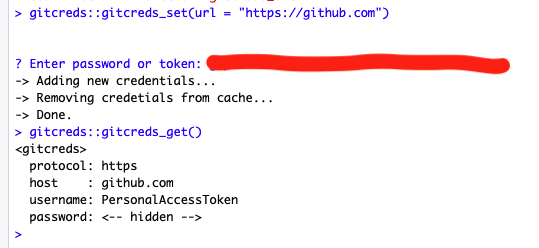

I have been avoiding setting up a Personal Access Token to authenticate my github account for a while because it seemed complicated. Never fear [Happy Git with R](https://happygitwithr.com/credential-caching.html) and `usethis()` to the rescue. 

### create a token

```
install.packages("usethis")

library(usethis)

usethis::create_github_token()

```

This will take you to github and create a token for you. Accept the defaults and copy the token. 

Go back to RStudio

### store it in your credentials

```
install.packages("gitcreds")

library(gitcreds)

gitcreds_set(url = "https://github.com")

```

Then it will ask you to Enter password or token...paste into your console. 


### check that it works

```
gitcreds_get()

```


