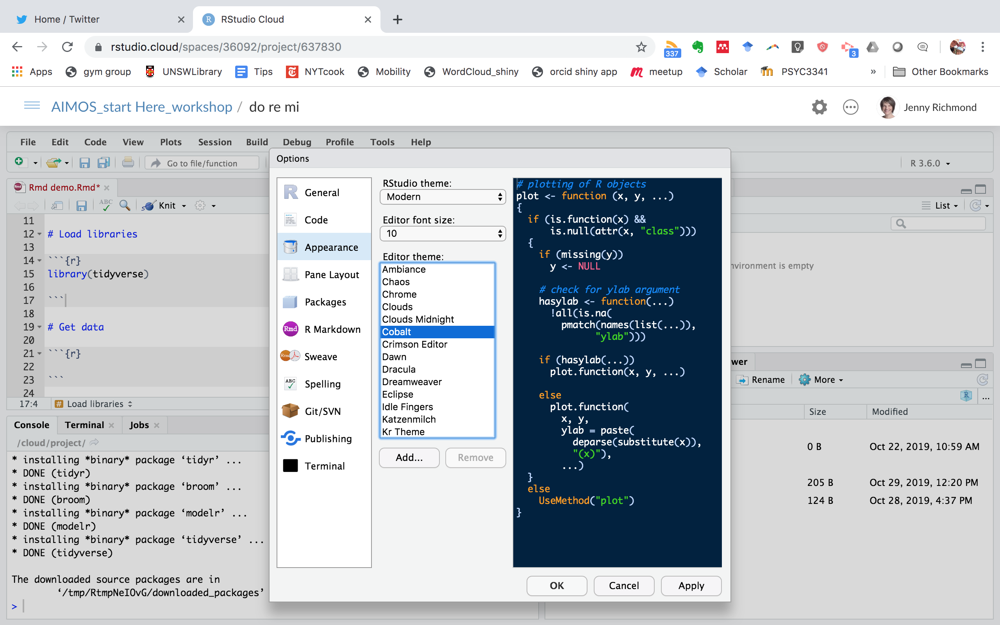
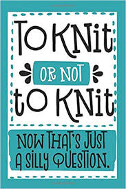
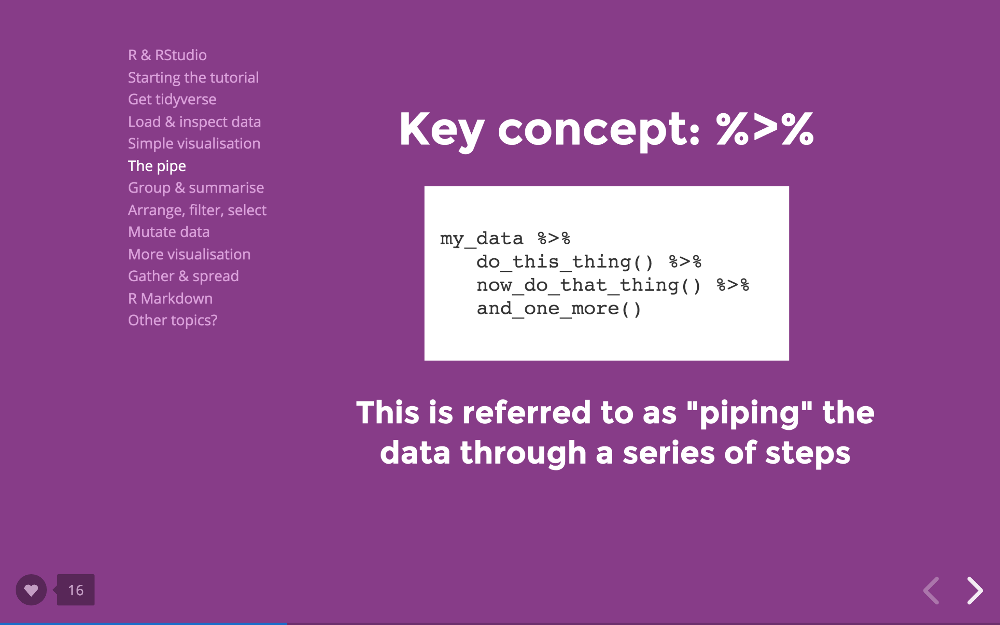

```{r setup, include=FALSE}
options(htmltools.dir.version = FALSE)
episode_counter <- 0
knitr::opts_chunk$set(
  collapse = TRUE,   
  comment = "#>"
)
```

```{r packages, include=FALSE}
library(countdown)
library(here)

```


class: title-slide, center, middle

<span class="fa-stack fa-4x">
  <i class="fa fa-circle fa-stack-2x" style="color: #ffffffcc;"></i>
  <strong class="fa-stack-1x" style="color:#e7553c;">`r rmarkdown::metadata$session`</strong>
</span> 

# `r rmarkdown::metadata$title`

## `r rmarkdown::metadata$subtitle`

### `r rmarkdown::metadata$author` &#183; `r rmarkdown::metadata$institution`

#### [`r params$site_link`](`r params$site_link`)

---
layout: true

<div class="my-footer"><span>`r params$site_link`</span></div>

---

.pull-left[

# The Plan

1. Why R?

2. Navigating RStudio

3. Getting your data in

4. Cleaning it up a little 

5. Maybe....probably not... summary stats/plotting

<br>

> You will need a laptop and access to wifi, but we will use RStudio Cloud, so don't worry about installation.

]


.pull-right[

```{r echo=FALSE, out.width= "700px"}
knitr::include_graphics("img/r_first_then.png")
```

Image credit: [Allison Horst](https://github.com/allisonhorst/stats-illustrations) @allison_horst from R-Ladies Santa Barbara

] 

]


---

class: center, middle

# Disclaimer

.pull-left[

#### Today we are really unlikely to know the answers to all your questions, but we can help you google!

#### Google is every R user's best friend, even Hadley Wickham. 


```{r echo=FALSE, out.width= "300px"}
knitr::include_graphics("img/google_hadley.png")
```

]

.pull-right[


```{r echo=FALSE, out.width= "600px"}
knitr::include_graphics("img/google_ResearcHers.png")
```

]


---

class: center, middle
 
# 1. Why R?

Lets introduce ourselves, why do you want to learn R?


---


  
# Why I R...

.left-narrow[ 

### [Reproducibility](https://www.nature.com/articles/s41559-017-0160)

### [One stop shop](https://twitter.com/kara_woo/status/1100908125396193281) 

### [Equity](https://rfortherestofus.com/2019/07/equity/)

### [Community](https://qz.com/work/1661486/r-ladies-made-data-science-inclusive/)

### [Fun!](https://headrush.typepad.com/creating_passionate_users/2005/06/kicking_ass_is_.html) 

] 


.right-wide[ 

```{r echo=FALSE, out.width= "800px"}
knitr::include_graphics("img/stats.jpeg")
```

Image credit Darren Dahly @statsepi

]


---

class: center

# Warning: You will want to quit

```{r echo=FALSE, out.width= "600px"}
knitr::include_graphics("img/pit.jpg")
```

---

class: center

```{r echo=FALSE, out.width= "900px"}
knitr::include_graphics("img/mountain.png")
```


Image credit Dani Navarro [Workflow](https://slides.com/djnavarro/workflow#/)

---

class: center

```{r echo=FALSE, out.width= "900px"}
knitr::include_graphics("img/climb.png")
```

Image credit Dani Navarro [Workflow](https://slides.com/djnavarro/workflow#/)

---

class: center

```{r echo=FALSE, out.width= "900px"}
knitr::include_graphics("img/team.png")
```

Image credit Dani Navarro [Workflow](https://slides.com/djnavarro/workflow#/)

---

class: center, middle

# Navigating RStudio

Link to RStudio Cloud Workspace

https://tinyurl.com/do-re-mi-aimos

---

class: inverse

# Your turn 1: Set up RStudio Cloud

.pull-left[

- Go to this link https://tinyurl.com/do-re-mi-aimos

- Sign up for an RStudio Cloud account

- Once at the Welcome screen, choose Projects, do-re-mi

- Let it deploy (it will chug a little bit)

<br>

]

.pull-right[

```{r echo=FALSE, out.width= "500px"}
knitr::include_graphics("img/cloud.png")

``` 
]
```{r echo=FALSE}
countdown(minutes = 3, seconds = 00)
```

---

class: center

# Think of R-Studio as your kitchen

```{r echo=FALSE, out.width= "700px"}
knitr::include_graphics("img/studio.jpg")
```

Image credit to Jessica Ward from @RLadiesNCL

---
class: inverse 

# Your turn 2: Let's start by redecorating

.pull-left[

From the top menu choose
- Tools
- Global Options
- Appearance

<br>

Then try out a few Editor themes and choose one you like. 
]

.pull-right[

```{r echo=FALSE, out.width= "600px"}

```

```{r echo=FALSE}
countdown(minutes = 4, seconds = 00)
```

]

---

class: center

# What questions do you have ?


```{r echo=FALSE, out.width= "700px"}
knitr::include_graphics("img/questions1.jpg")

``` 


---

# Packages

A package is a group functions that some kind person has written, tested, bundled together and given away for everyone to use. 

<br>

.pull-left[

To install packages, type into your console. Just do this once. 

<br>

To use a package, load it using the `library()` function. You need to do this every time you want to use the functions in a package. 


]

.pull-right[

```
install.packages("packagename")

```

<br>

```
library(packagename)

```

]

---

# What is the tidyverse?  

.pull-left[

The tidyverse is a mega-package (i.e. a package of other packages) designed to make data wrangling and visualisation easier.  

```{r message=FALSE, warning=FALSE}
library(tidyverse)
```

is the same as...

```{r message=FALSE, warning=FALSE}
library(readr)
library(dplyr)
library(tidyr)
library(ggplot2)
library(purrr)
library(tibble)
library(stringr)
library(forcats)

```


] 

.pull-right[

```{r echo=FALSE, out.width= "700px"}
knitr::include_graphics("img/tidy_workflow.png")

``` 

] 

It's a good idea to put `library(tidyverse)` at the top of every analysis document. You will probably need it. 
---

class: inverse 

# Your turn 3: Install some packages

Step 1. In your console, install the following packages...

- janitor
- here
- beepr
- skimr

```{r eval = FALSE}
install.packages("packagename")
```

Step 2. Then open the Rmd_demo_babynames.Rmd file and find the grey "chunk" that has  `library(tidyverse)` in it. Add these below to load the following packages. 

```
library(janitor) 
library(here)
library(beepr)
library(skimr)

```
Run the code in the chunk using the little green arrow on the right 

```{r echo=FALSE}
countdown(minutes = 4, seconds = 00)
``` 


---

class: center

# What questions do you have ?

<br>
<br>

```{r echo=FALSE, out.width= "700px"}
knitr::include_graphics("img/questions2.jpg")

``` 

---

# An aside about RMarkdown

.pull-left[

RMarkdown documents (or .Rmd files) are key to reproducible analysis. 
- notes/explanations + "chunks" of R code 
- "knit" the document (notes + code + output) into a nice format that other people (who may not know R) can access. 

### Tricks and tips

- Insert a chunk using shortcut Alt-Cmd-I
- Hash to get levels of heading
- Asterisks to get bold and italics
] 


.pull-right[

```{r echo=FALSE, out.width= "700px"}
knitr::include_graphics("img/rmarkdown_wizards.png")

```

Image credit: [Allison Horst](https://github.com/allisonhorst/stats-illustrations) @allison_horst from R-Ladies Santa Barbara
] 

 
---

class: inverse

# Your turn 4: "Knit" your RMarkdown document

.pull-left[

Change a few things about the text in the demo.Rmd doc

- Change the title at the top
- Add a few headings using #
- Make words bold by putting them in double asterik

Then choose "Knit" and check out the output. 
] 

.pull-right[

<iframe src="https://giphy.com/embed/26BRIVreINK0mQdW0" width="480" height="352" frameBorder="0" class="giphy-embed" allowFullScreen></iframe><p><a href="https://giphy.com/gifs/wind-hat-gnome-26BRIVreINK0mQdW0">via GIPHY</a></p>

] 

<br>

```{r echo=FALSE}
countdown(minutes = 2, seconds = 00)
```


---
class: center

# What questions do you have ?

```{r echo=FALSE, out.width= "300px"}


``` 

---

class: center, middle

 # Getting data in

---

# Where is the data?

.pull-left[

```{r echo=FALSE, out.width= "350px"}
knitr::include_graphics("img/here.png")
```

]

.pull-right[

The `here` package will help avoid file path drama. You can use it to tell R where you data is, relative to the top level of your project folder.

We can use the `read_csv()` from `readr` and `here()` to read a .csv file.

Image credit: [Allison Horst](https://github.com/allisonhorst/stats-illustrations) @allison_horst from @RLadiesSB


]

<br>


#### Template code

```
my_data_in_r <- read_csv(here("data_folder", "filename.csv"))

```

---


class: inverse

# Your turn 5: Read in the babynames data

- Step 1: Make a new chunk (Cmd-Option-I)

- Step 2: Copy the template code

```
my_data_in_r <- read_csv(here("data_folder", "filename.csv"))

```

- Step 3: Adapt the template to read in the SAbabynames.csv data 

- Step 4: Play with the code in each chunk to plot...

   - How popular is your name?
   - How popular is your name relative to your neighbours?
   
- Step 5: Knit your document (** use the cog to change the display option to Show Code and Output)
   
```{r echo=FALSE}
countdown(minutes = 10, seconds = 00)
```
   

---
class: center, middle

# What questions do you have ?

```{r echo=FALSE, out.width= "300px"}
knitr::include_graphics("img/questions3.png")

``` 

---

class: center, middle

# Before we break... a key idea 

```{r echo=FALSE, out.width= "600px"}


``` 

Image credit Dani Navarro [Tidyverse for Beginners](https://slides.com/djnavarro/tidyverse-for-beginners#/)

---

class: center, middle

# Time for a break...

### Next up.... your own data

```{r echo=FALSE}
countdown(minutes = 5, seconds = 00)
```

---

class: inverse

# Your turn 6: Lets get YOUR data in  

<br>

- Step 1: Upload your data into the data folder

- Step 2: Make a new RMarkdown document (File-NewFile-RMarkdown), save as my_analysis.Rmd

- Step 3: Make a new chunk (Cmd-Option-I) and load packages using library() 

- Step 4: Make another new chunk, copy the template code

```
my_data_in_R <- read_csv(here("data_folder", "filename.csv"))

```

- Step 5: Adapt the template to match your datafile

- Step 6: Run the chunk to read your data in 
   
- Step 7: Have a look at your data, any obvious problems?

```{r echo=FALSE}
countdown(minutes = 5, seconds = 00)
``` 
   

---

# YAY your data is in R!

.pull-left[

## But its probably "dirty". 

#### Maybe...

#### ... the variable names are weird and inconsistent
#### ... you regret your choice of variable names
#### ... you don't need all of those variables

]

.pull-right[

```{r echo=FALSE, out.width= "600px"}
knitr::include_graphics("img/dplyr_wrangling.png")

``` 

Image credit: [Allison Horst](https://github.com/allisonhorst/stats-illustrations) @allison_horst from R-Ladies Santa Barbara

]

---

## clean_names() from `janitor` 


### Problem 1: all of the variable names are weird and inconsistent

```
better_data_in_R <- your_data_in_R %>%
               clean_names()
```

```{r echo=FALSE, out.width= "500px"}
knitr::include_graphics("img/janitor_clean_names.png")
``` 

---

## rename() from `dplyr`

### Problem 2: you regret your variable names 

```
betterdata <- yourdata %>%
  rename(newname1 = oldname1, newname2 = oldname2)
  
```
<br>


<br>

> NOTE: I can never remember the order of the names in this function. 
Is it old = new? or new = old? 
I have resorted to a stupid mnemonic... it happens to be alphabetical (i.e. L-M-New = Old) 

---

## select() from `dplyr`

### Problem 3: you don't need all of those variables

Keep just the columns you name

``` 
better_data_in_R <- your_data_in_R %>%
  select(age, gender, score) 
```
Keep columns 1 thru 5, and 8 thru 12

```
better_data_in_R <- your_data_in_R %>%
  select(1:5, 8:12)

```

Use - to drop named variable, keeping everything else

```
better_data_in_R <- your_data_in_R %>%
  select(-date) 

```
---

class: inverse

# Your turn 7: Clean up your own data

Use clean_names() if your variable names are weird

```
better_data_in_R <- your_data_in_R %>%
               clean_names()
```


Use select() to pare down to just the variables you need 

``` 
better_data_in_R <- your_data_in_R %>%
  select(age, gender, score) 

```
Use rename() to give your variables more useful names 

```
better_data_in_R <- your_data_in_R %>%
  rename(newname1 = oldname1)
  
```

```{r echo=FALSE}
countdown(minutes = 15)
``` 

---

class: center

# What questions do you have ?

```{r echo=FALSE, out.width= "300px"}
knitr::include_graphics("img/questions4.jpg")

``` 

---


# Well done! Your data is in and a little cleaner. 

.pull-left[

### I think we are going to get to here, the rest of these slides cover...

1. how to make your data tidy (i.e. convert it from wide format into long format)
2. how to use summary(), skim(), and group_by() + summarise() to get summary stats
3. the basics of ggplot

]

.pull-right[

<iframe src="https://giphy.com/embed/ZdUnQS4AXEl1AERdil" width="480" height="400" frameBorder="0" class="giphy-embed" allowFullScreen></iframe><p><a href="https://giphy.com/gifs/Friends-season-6-friends-tv-episode-602-ZdUnQS4AXEl1AERdil">via GIPHY</a></p>

]

---

# Recommended learning resources

### RYouWithMe (online course)

https://rladiessydney.org/courses/ryouwithme/

### R for Data Science (free e-book)

https://r4ds.had.co.nz/

### RStudio Education site (lots of great resources)

https://education.rstudio.com/


---

class: centre

# Until next time....

<iframe src="https://giphy.com/embed/xIJLgO6rizUJi" width="480" height="367" frameBorder="0" class="giphy-embed" allowFullScreen></iframe><p><a href="https://giphy.com/gifs/alice-in-wonderland-thank-you-xIJLgO6rizUJi">via GIPHY</a></p>


---

# Keep working through these slides to learn about

### pivot_longer() and pivot_wider()
### summary(), skim(), group_by() %>% summarise()
### ggplot() 


---

##  Your data is clean-er, but is it "tidy"? 

## Three rules for tidy data:

- Each variable must have its own column.
- Each observation must have its own row.
- Each value must have its own cell.

```{r echo=FALSE, out.width= "700px"}
knitr::include_graphics("img/tidy-1.png")

``` 

Image credit: [R4DS](https://r4ds.had.co.nz/tidy-data.html)


<br> 
<br> 
<br> 

Read more about tidy data [Wickham (2014)](https://www.jstatsoft.org/article/view/v059i10)

---

# Wide to Long

```{r echo=FALSE, out.width= "1000px"}
knitr::include_graphics("img/wide_long.png")

``` 

---

# pivot_longer() from `tidyr`

### pivot_longer wants to know 3 things
1. names_to = what you want to call the new column containing the names of the columns 
2. values_to = what you want to call the new column containing the values 
3. the range of columns that you want to make long (col1:col6)
 
<br>

```
longdata <- wide %>% 
            pivot_longer(names_to = "new_names_col", 
                    values_to = "new_values_col", col1:col6)
```
---

class: middle, center

# My turn: Make favourite things long  

---

class: inverse

# Your turn 8: make your wide data long

Take a look at your data and work out ...

1. which columns need to become long
2. what the values column should be called
3. what the "names" column should be called

<br>

```
longdata <- wide %>% 
      pivot_longer(names_to = "new_names_col", 
                  values_to = "new_values_col", col1:col6)
```

```{r echo=FALSE}
countdown(minutes = 15, seconds = 00)
``` 

---

# Before we break... reminding you about a key idea 

### The pipe %>% allows you to string together a series of functions and accomplish a LOT in just a few lines of code

```
ready_to_plot <- raw_data %>%
  select(Just, The, Columns, You, Want) %>%
  rename(just = Just, the = The, columns = Columns, you = You, want = Want) %>%
  pivot_longer(names_to = "condition", values = "response", columns:want)
  
```
---

class: center, middle

# Time for a break...

### Next up.... summary stats & plotting

```{r echo=FALSE}
countdown(minutes = 10, seconds = 00)
```

---

# Get a quick summary of...

## ... the structure of your data

```
head(yourdata)

str(yourdata)

length(yourdata)

glimpse(yourdata)

names(yourdata)

```
---

# Get some quick summary stats

There are lots of ways to get summary stats in R. 

.pull-left[

#### base R

```
summary(yourdata)

```
#### `skimr` package

```
skim(yourdata)

```

]

.pull-right[

#### `dplyr` package 

```
summary_stats <- yourdata %>%
  group_by(something_interesting) %>%
  summarise(mean = mean(resp), 
            stdev = sd(resp), 
            n = n(), 
            se = stdev/sqrt(n))
            
```
]


---

class: middle, center

# My turn: summarise my favourite things 


---

class: inverse

# Your turn 9: Get some summary stats from your data

Try out summary() or skim(), or create a dataframe using this code template 

```
summary_stats <- yourdata %>%
  group_by(something_interesting) %>%
  summarise(mean = mean(resp), 
            stdev = sd(resp), 
            n = n(), 
            se = stdev/sqrt(n))
            
```

> Heads Up: do you need na.rm = TRUE?

```{r echo=FALSE}
countdown(minutes = 10, seconds = 00)
``` 

---

class: center

# What questions do you have ?

```{r echo=FALSE, out.width= "300px"}
knitr::include_graphics("img/questions5.jpg")

``` 

---

class: center, middle

# We made it! Lets make a ggplot! 


---

# The grammar of graphics 

### ggplot wants to know 3 things
1. what data you want to plot
2. the "aesthetics" i.e. which variables you want on the x and y, what things look like (colour/shape/fill)
3. which "geom" you want to use (point, line, col, histogram, violin)

```
ggplot(data, aes(x = __, y = __)) +
  geom_point()
```
#### WATCH OUT! You can pipe data into ggplot (and combine with dplyr functions) but within ggplot you need to ADD LAYERS with +


```
data %>%
  filter(interesting_variable > z) %>%
  ggplot(aes(x = __, y = __)) +
  geom_point() 
  
  
```
---

class: middle, center

# My turn: plot favourite things

---


class: inverse

# Your turn 10: Plot your data

.pull-left[
```
ggplot(data, aes(x = __, y = __)) +
  geom_point()
```

```
data %>%
  filter(interesting_variable > z) %>%
  ggplot(aes(x = __, y = __, colour = condition)) +
  geom_point() +
  facet_wrap(~ group)
  
  ggsave("your_first_ggplot.png")
  
```

]

.pull-right[

```{r echo=FALSE, out.width= "400px"}
knitr::include_graphics("img/ggplot2_masterpiece.png")

``` 

Image credit: [Allison Horst](https://github.com/allisonhorst/stats-illustrations) @allison_horst from R-Ladies Santa Barbara

]

```{r echo=FALSE}
countdown(minutes = 10, seconds = 00)
``` 

---

# Google: How to I add/get rid of  ________ ggplot in R?

.pull-left[ 

### 1. error bars
### 2. axis labels
### 3. a title
### 4. legend
### 5. colour ....

]

.pull-right[

```{r echo=FALSE, out.width= "400px"}
knitr::include_graphics("img/google_hadley.png")

``` 

]

Or check out the [R Graph Gallery](https://www.r-graph-gallery.com/index.html) for inspiration and code

---

# The End....

<iframe src="https://giphy.com/embed/xIJLgO6rizUJi" width="480" height="367" frameBorder="0" class="giphy-embed" allowFullScreen></iframe><p><a href="https://giphy.com/gifs/alice-in-wonderland-thank-you-xIJLgO6rizUJi">via GIPHY</a></p>


---

