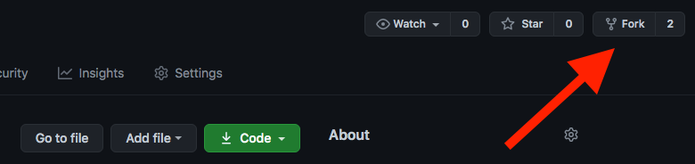
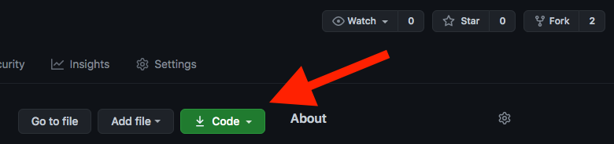
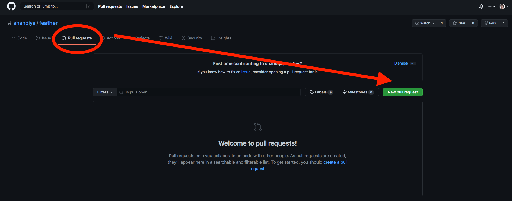
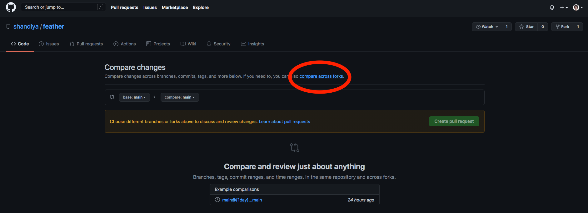
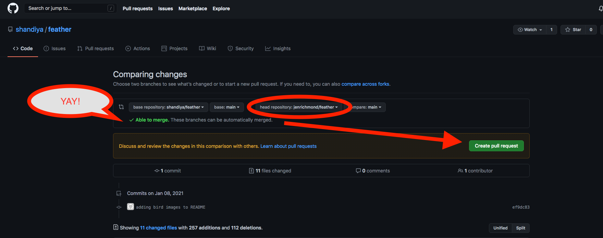
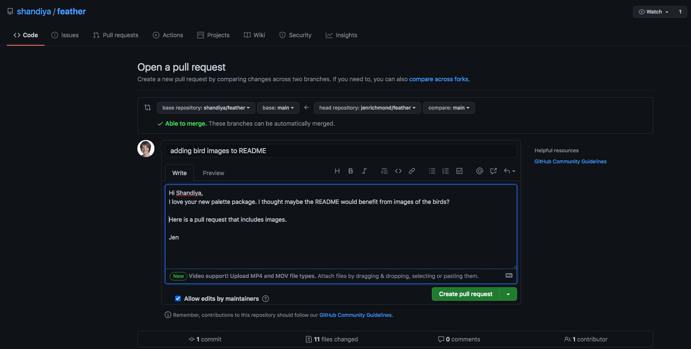

```{r setup, include=FALSE}
knitr::opts_chunk$set(echo = TRUE)
```


There are so many lovely packages for colour palettes (see links at the bottom of [this post](http://jenrichmond.rbind.io/post/idhtg-how-to-use-colour-palettes-with-ggplot/) for more). 

This new one called `feather` by [Shandiya Balasubramanium](https://shandiyabalasubramaniam.weebly.com/) is inspired by Australian birds and is delightful. 

<blockquote class="twitter-tweet"><p lang="en" dir="ltr">Today I built my first R package! Meet feather: a set of colour palettes inspired by the plumage of Australian birds. It&#39;s a work in progress and a bit rough around the edges, but I&#39;m pretty proud of it<a href="https://twitter.com/hashtag/RStats?src=hash&amp;ref_src=twsrc%5Etfw">#RStats</a> <a href="https://twitter.com/hashtag/WildOz?src=hash&amp;ref_src=twsrc%5Etfw">#WildOz</a> <a href="https://twitter.com/hashtag/DataVisualization?src=hash&amp;ref_src=twsrc%5Etfw">#DataVisualization</a> <a href="https://t.co/9kjavQ4Q50">https://t.co/9kjavQ4Q50</a></p>&mdash; Shandiya Balasubramaniam (@ShandiyaB) <a href="https://twitter.com/ShandiyaB/status/1347116050714816513?ref_src=twsrc%5Etfw">January 7, 2021</a></blockquote> <script async src="https://platform.twitter.com/widgets.js" charset="utf-8"></script>


The vignette doesn't have any pictures of the birds though, so I thought it might be a good opportunity to help [Shandiya](https://twitter.com/ShandiyaB) out and try my first pull request. I am documenting the process here, so I can refer back to it for next time. 

# Trying out the feather package

I've installed the feather package from github... 

```{r eval = FALSE}
devtools::install_github("shandiya/feather")
```

... and loaded the palette names
```{r}
library(feather)

names(feather_palettes)
```


You can print each palette by using the `get_pal()` function and the `print_pal()` function. There is the palette for the Eastern Rosella

```{r}
er <- get_pal("eastern_rosella")

print_pal(er)
```


# Adding bird images for each palette

## Eastern Rosella

```{r echo=FALSE, out.height='75%', out.width='75%'}
knitr::include_graphics("https://upload.wikimedia.org/wikipedia/commons/thumb/3/33/Platycercus_eximius_diemenensis_male.jpg/800px-Platycercus_eximius_diemenensis_male.jpg")
```

Image credit: [JJ Harrison](https://www.jjharrison.com.au/). This file is licensed under the [Creative Commons](https://en.wikipedia.org/wiki/Creative_Commons) [Attribution-Share Alike 3.0 Unported license](https://creativecommons.org/licenses/by-sa/3.0/deed.en). Image source: [Wikimedia Commons](https://commons.wikimedia.org/wiki/File:Platycercus_eximius_diemenensis_male.jpg). 


```{r echo=FALSE}
er <- get_pal("eastern_rosella")

print_pal(er)
```

## Plains wanderer

```{r echo=FALSE, out.height='75%', out.width='75%'}
knitr::include_graphics("https://upload.wikimedia.org/wikipedia/commons/thumb/8/8a/Pedionomus_torquatus%2C_NSW_1.jpg/1024px-Pedionomus_torquatus%2C_NSW_1.jpg")
```

Image credit: [Patrick_K59](https://www.flickr.com/photos/patrick_k59/14368940377/). This file is licensed under the CC BY 2.0, https://commons.wikimedia.org/w/index.php?curid=34831381. Image source: [Wikimedia Commons](https://commons.wikimedia.org/wiki/File:Pedionomus_torquatus,_NSW_1.jpg). 


```{r echo=FALSE}
pw <- get_pal("plains_wanderer")

print_pal(pw)
```


## Rose crowned fruit dove

```{r echo=FALSE, out.height='60%', out.width='60%'}
knitr::include_graphics("https://upload.wikimedia.org/wikipedia/commons/thumb/8/82/Rose-Crowned_Fruit_Dove.jpg/800px-Rose-Crowned_Fruit_Dove.jpg")
```

Image credit: [Bjørn Christian Tørrissen](http://bjornfree.com/galleries.html), CC BY-SA 3.0, https://commons.wikimedia.org/w/index.php?curid=6874281


```{r echo=FALSE}
rcfd <- get_pal("rose_crowned_fruit_dove")

print_pal(rcfd)
```

## Bee eater

```{r echo=FALSE, out.height='50%', out.width='50%'}
knitr::include_graphics("https://upload.wikimedia.org/wikipedia/commons/thumb/d/df/Merops_ornatus_-_Centenary_Lakes.jpg/800px-Merops_ornatus_-_Centenary_Lakes.jpg")
```


Image credit: [JJ Harrison](https://www.jjharrison.com.au/). This file is licensed under the [Creative Commons](https://en.wikipedia.org/wiki/Creative_Commons) [Attribution-Share Alike 3.0 Unported license](https://creativecommons.org/licenses/by-sa/3.0/deed.en). Image source: [Wikimedia Commons](https://commons.wikimedia.org/wiki/File:Merops_ornatus_-_Centenary_Lakes.jpg). 

```{r echo=FALSE}
be<- get_pal("bee_eater")

print_pal(be)
```


# Contributing to a package with a pull request

When making a pull request you are asking the person who wrote the package (or who owns the repo) to pull the changes you have made into the original repo. 

https://docs.github.com/en/free-pro-team@latest/github/collaborating-with-issues-and-pull-requests/creating-a-pull-request-from-a-fork

### Step 1: fork the repo

Forking is the process of creating a copy of a repo owned by someone else in your github account. There is a button on the top right corner of every github repo that allows you to Fork a copy. 

```{r echo=FALSE}

```

### Step 2: clone the repo

Once you have a copy of the repo in your github account, use the green button to clone the forked copy on to your machine. 

```{r echo=FALSE}

```

You can copy the url and within RStudio use File-New project-From Version control. Or in the terminal use... 

1. `pwd` to print your working directory and then 
2. `cd` to navigate to the folder where you want to clone 
3. `git clone "paste URL"`  to clone the repo into that location 

``` 

pwd 

cd Users/jenny/Desktop/git

git clone "paste URL here"

```

### Step 3: make changes to your local copy

Once you clone the repo to your machine, you can make changes. I open the README.Rmd file added the images linked above. I knitted the README to check it that it looked OK and saved the file.


### Step 4: push your changes to your forked copy

Once I had the README looking like I wanted, I pushed my changes to the forked copy in my repo using these commands in the terminal. 

```
git add .

git commit -m "adding bird images to README"

git push

```


### Step 5: make a pull request

Now for the hard bit, fingers crossed. I'm following the [instructions here](https://docs.github.com/en/free-pro-team@latest/github/collaborating-with-issues-and-pull-requests/creating-a-pull-request-from-a-fork). 

1. Refresh the browser on your forked repo and check that the README now includes your changes.


2. Navigate to the original repo (where you created the fork in the first place) and choose the Pull requests tab. 

```{r echo=FALSE}

```

3. Choose New pull request and the "compare across forks" option

```{r echo=FALSE}

```
4. Choose your fork as the head repository to compare and see whether your changes can be merged automatically. Click Create pull request. 

```{r echo=FALSE}

```

5. Write a note to the repo owner as an issue. 

```{r echo=FALSE}

```

6. Wait and see if they like your changes :)


```{r echo=FALSE}
knitr::include_graphics("pr5.png")
```


7. Celebrate!

<iframe src="https://giphy.com/embed/3oz8xRF0v9WMAUVLNK" width="480" height="320" frameBorder="0" class="giphy-embed" allowFullScreen></iframe><p><a href="https://giphy.com/gifs/studiosoriginals-3oz8xRF0v9WMAUVLNK">via GIPHY</a></p>