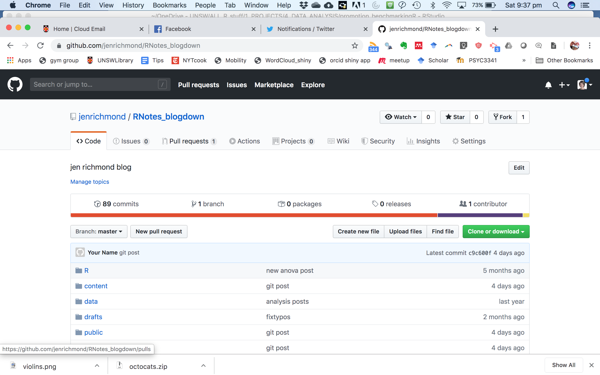

I started a blog post and pushed it to the git repo that contains my blog. Charles forked my repo, cloned it to her machine, contributed to the post, and then pushed the updates to her forked copy of the repo. 

Then she did a *pull request*. People in git-land talk about PRs (pull requests) all the time, and the term seems backwards to me. A pull request is when you request that the owner of a repo "pull" the changes that you have made.

Miraculously, there were no conflicts so I merged her contribution with my repo, and then because the blog deploys from git on netlify, it updated the blog automatically. 

Because the new content was in my git repo but not on my local machine, I needed to pull the changes to my local machine, but that went smoothly too! 

We were victorious!!

<blockquote class="twitter-tweet"><p lang="en" dir="ltr">I am declaring us victorious, <a href="https://twitter.com/JenRichmondPhD?ref_src=twsrc%5Etfw">@JenRichmondPhD</a> . Mistresses of Git.<br><br>We successfully wrote a blog post together *using R* about collaborating via Git! 🥐I forked and cloned and then I pr-ed. 🦆 <br><br>Mostly we got better at burning it all down, <a href="https://twitter.com/mdsumner?ref_src=twsrc%5Etfw">@mdsumner</a>.. <a href="https://t.co/vZ2XAQBRdw">https://t.co/vZ2XAQBRdw</a> <a href="https://t.co/Ubil1ZlD8W">pic.twitter.com/Ubil1ZlD8W</a></p>&mdash; Cap&#39;n Blackheart Bette (@cantabile) <a href="https://twitter.com/cantabile/status/1195891644567998464?ref_src=twsrc%5Etfw">November 17, 2019</a></blockquote> <script async src="https://platform.twitter.com/widgets.js" charset="utf-8"></script>

# what did we learn?


```{r out.width= "700px"}

``` 